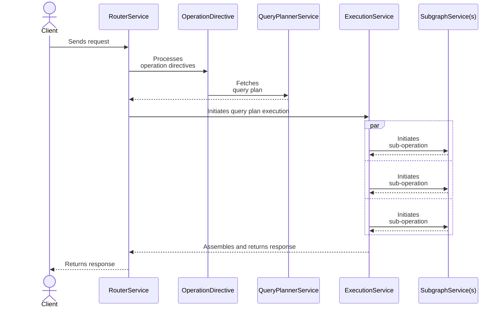

A Schema may contain:
* Schema directives
* Operation directives

The Apollo Router supports behaviour customization via both mechanisms.

## Customization types

The Apollo Router supports two types of schema driven customization:

* [Schema](./schema/)
* [Operation](./operation/)

### Which customization type should I use?

A schema directive alters the way the router works for all operations. An operation directive will operate at the intersection of a schema and an operation taking information from both and only altering behaviour for a subset of operations.

If you wish to modify the behaviour of the router based solely on the information contained within the schema, then you are going to be processing schema directives. If you wish to interact with an operation, then you are going to be processing operation directives.

### Schema Directives

For example, it may be possible to have a schema which contains a `rest` directive which would specify an `endpoint` for resolving data fields. This kind of customization isn't going to require any interaction with the contents of an operation and so can be applied as customization as soon as the schema is processed.

### Operation Directives

For example, it may be possible to have a schema which contains an `auth` directive which would specify a `role` which must be possessed by the operation submitter for resolving data fields. This kind of customization requires interaction with the contents of an operation and so can only be applied within the context of an operation.

Before building an Apollo Router customization, it helps first to understand how the router handles each incoming GraphQL request. During each request's execution, four **services** in the router communicate with each other as shown:

Note: The schema directives are processed each time the router is notified that a new schema has been provided.

The main pipeline is processed using pipeline extensions. The operation directives are processed immediately prior to query planning. Operation directives must not make assumptions about:

* order of execution (with respect to other directives)
* frequency of execution

This is to maximise portability and efficiency of directive processing within the router.

### Schema Directives

Schema directives

Each Apollo Router service has a corresponding function that a customization can define to hook into that service:

| Service | Function | Description |
|---------|----------|-------------|
| `RouterService` | `router_service` | 
This service runs at the very beginning and very end of the request lifecycle.

Define `router_service` if your customization needs to interact at the earliest or latest point possible. For example, this is a good opportunity to perform JWT verification before allowing a request to proceed further. 
|
| `QueryPlannerService` | `query_planning_service` | 
This service handles generating the query plan for each incoming request. 

Define `query_planning_service` if your customization needs to interact with query planning functionality (for example, to log query plan details).
 |
| `ExecutionService` | `execution_service` | 
This service handles initiating the execution of a query plan after it's been generated.

Define `execution_service` if your customization includes logic to govern execution (for example, if you want to block a particular query based on a policy decision).
|
| `SubgraphService` | `subgraph_service` | This service handles communication between the Apollo Router and your subgraphs. Define `subgraph_service` to configure this communication (for example, to dynamically add headers to pass to a subgraph). |

> _Most_ customizations use `router_service` and/or `subgraph_service`, whereas the other service functions are less common.

Each service has a request and response data-structure that holds:
* A context object that was created at the start of the request and is propagated throughout the entire request lifecycle. It holds:
    - The original request from the client
    - A bag of data that can be populated by plugins for communication across the request lifecycle
* Any other specific data to that service (e.g., query plans and downstream requests/responses)
